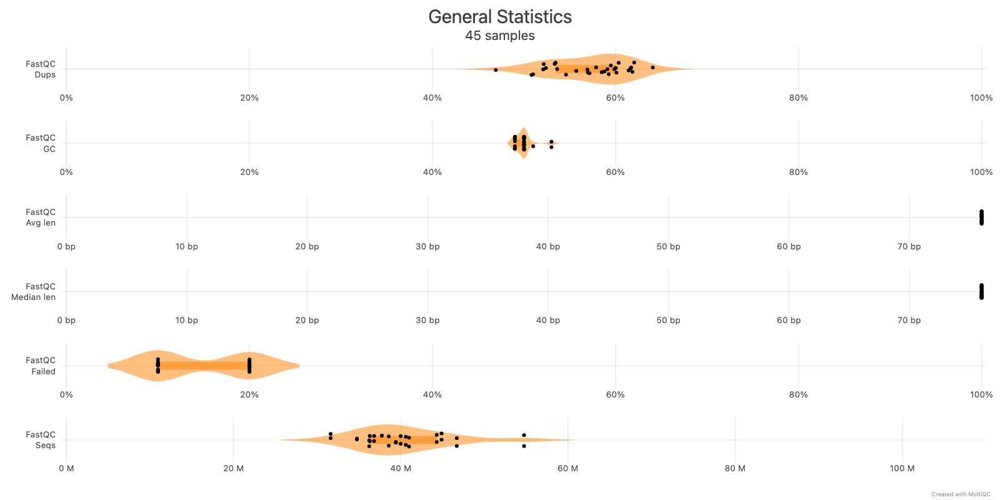
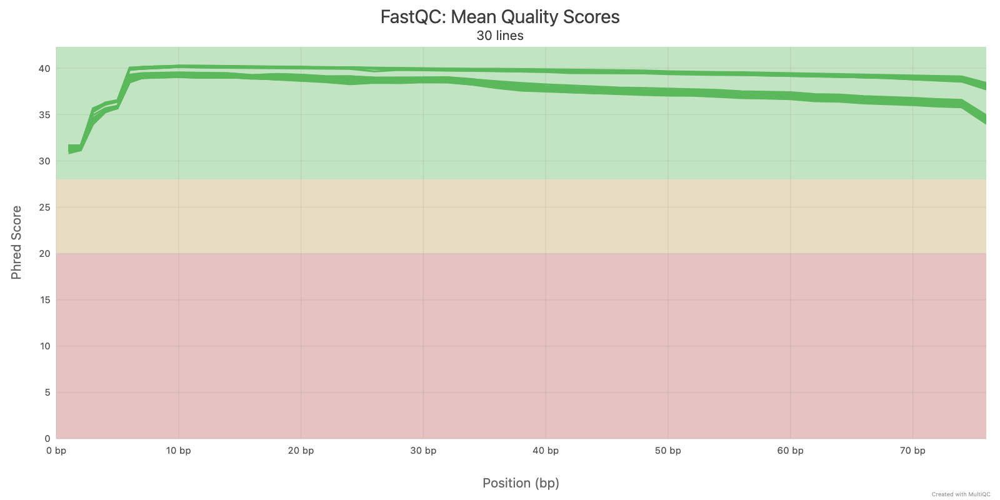
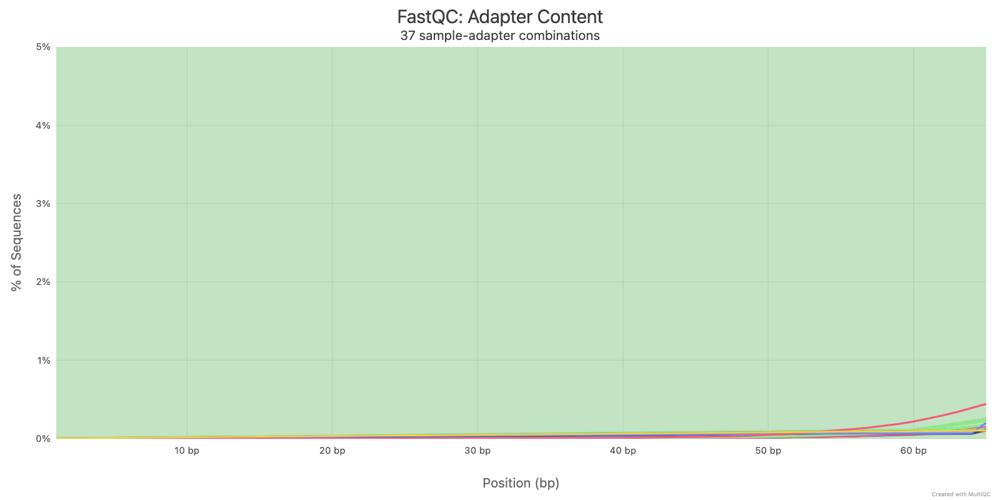
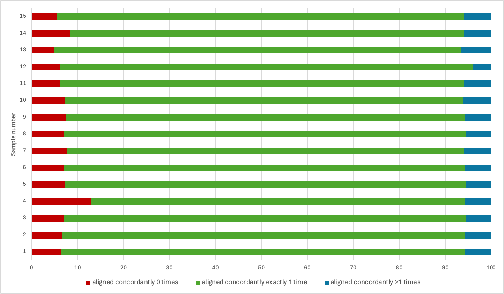
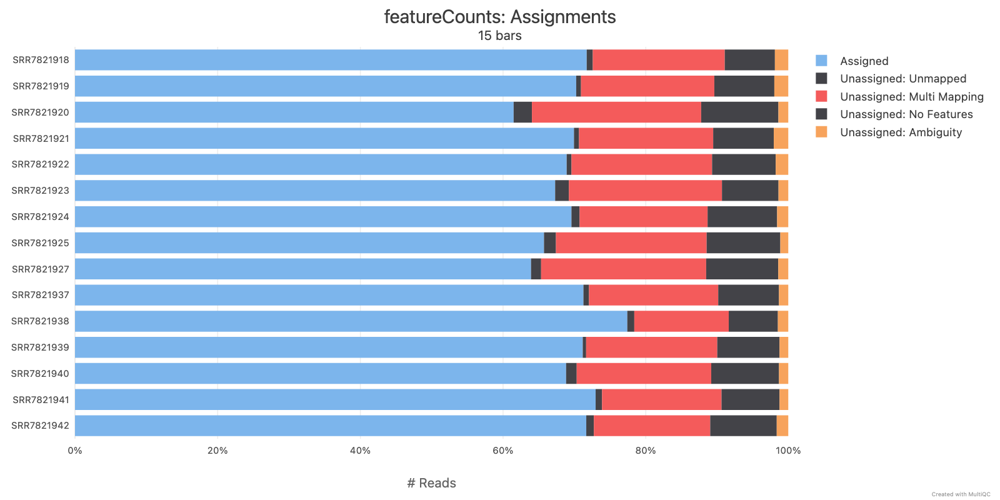
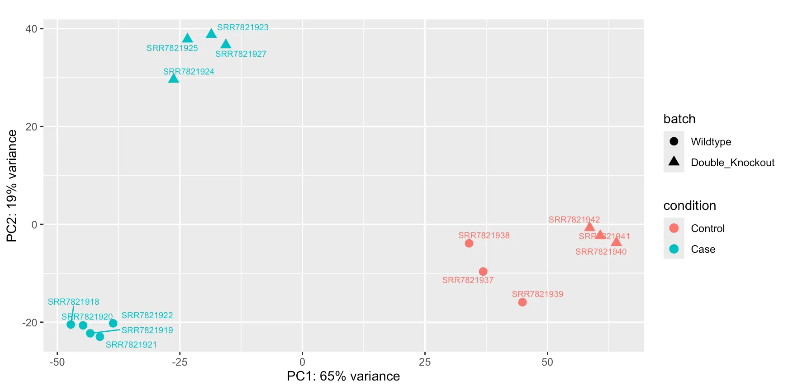
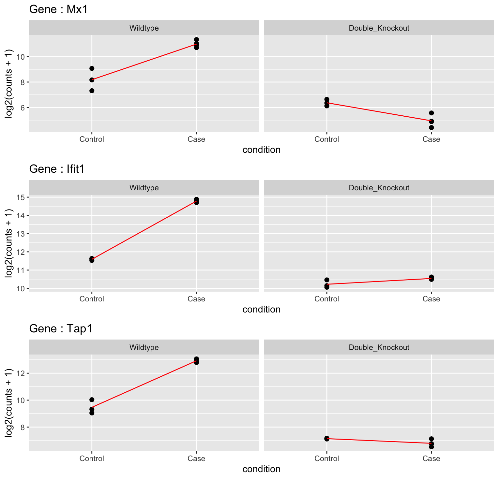

# RNAseq Project

## About project 

This project investigates the pulmonary immune response to *Toxoplasma gondii* infection in mice using bulk RNA-seq data analysis. *T. gondii* is a medically important intracellular parasite capable of causing severe disease in immunocompromised individuals and in susceptible tissues such as the lungs during acute infection.

Using a dataset designed to profile global immune transcriptional responses across multiple pathogens, we focus here on comparing wild-type mice with double-knockout (IFNAR⁻/⁻ IFNGR⁻/⁻) mice to assess the contribution of type I and type II interferon signaling pathways to lung immunity during *T. gondii* infection.

## Installation

```bash
#In your computer
##clone the repository 
git clone https://github.com/MOISECHRIST/RNAseq_Project.git 
##Move in the repository
cd RNAseq_Project

#In the IBU cluster 
##clone the repository 
git clone git@github.com:MOISECHRIST/RNAseq_Project.git /data/user/${USER}/RNAseq_Project
##Move in the repository 
cd /data/user/${USER}/RNAseq_Project
```

## Run analysis

### For the HPC (IBU) part 
```bash
chmod u+x main.sh
./main.sh
```

### For the R data analysis
```bash
Rscript --vanilla ./scripts/13-Run_R_data_analysis.R /path/to/RNAseq_Project
```

## Methodology 

### Data set 

The lung dataset provided for this project contains 15 samples, each represented by paired-end Illumina FASTQ files with a read length of 75 bp, as well as a README file containing the associated metadata. Inspection of the README indicates that the dataset includes four experimental groups: 
- WT control (3 samples), 
- WT case (5 samples), 
- DKO control (3 samples), 
- and DKO case (4 samples). 

The DKO mice carry a homozygous deletion of the interferon receptors Ifngr (Ifngr-/-) and Ifnar (Ifnar-/-).

### Quality Control

The lung data set contain 15 samples which with paired-end fastq file and a README file containing metadata about each sample. To assess the quality control of our data set, we use [FastQC](https://www.bioinformatics.babraham.ac.uk/projects/fastqc/) , a tools using to assess quality of fastq files. For each sample, FastQC gives a report (html) and some additional data in a archive. These archives are using by [MultQC](https://github.com/MultiQC/MultiQC) to merge the quality report of each fastq file in only one report (html).

### **Map reads to the reference genome**

In this step of our analysis workflow we used [Hisat2](http://daehwankimlab.github.io/hisat2/) to align our paired-end sequences to the reference (Mus Musculus GRCm39.115) downloader from [Ensembl ftp site](https://www.ensembl.org/info/data/ftp/index.html).  In this particular step, we first did indexing of the reference using Hisat2, then for each sample we align the reads from fastq file to the reference. The results Sam files (one per sample) are use as input in [Samtools view](http://www.htslib.org/doc/samtools.html) to convert them into Bam files. After obtaining the Bam files, the next steps are sorting Bam files and indexing the sorted Bam files. 

In addition to quality report given by Hisat2 during the alignment, we also get other information with [Samtools stats](http://www.htslib.org/doc/samtools.html) and [Samtools coverage](http://www.htslib.org/doc/samtools.html) to assess how the alignment was performed.

### **Count the number of reads per gene**

After read mapping, the next step in our workflow was to count the number of reads per gene. Here, we used the [featureCounts](https://subread.sourceforge.net/featureCounts.html) tool on all our BAM files, which returned a feature count table containing all genes in our reference in the rows and the sample ID in the columns.

The second result of featureCounts is a summary text file. This summary text file was loaded into a MultiQC report to get a better glimpse of the per-gene counting read statistics. 

### Exploratory data analysis

### Differential expression analysis

### Overrepresentation analysis

## Results 

Presented below are the results of the analyses performed on the lung dataset, along with the answers to the various questions asked at each stage of the project.

### Quality Control

Below we are going to answer to all question about quality control of our 15

**Question 1 :** How many reads do we have per sample?

For each sample, the total number of reads is the same for the 2 pairs. If we considerate only one mate for each sample, the range of the total number of reads is from 31.6M to 54.7M. More than the half of our data set have less than 40M of reads (53.33%). The second bigger part is between 40M still 50M, where we have 40% of our same. There is only one sample with the total of reads more than 50M (**SRR7821924**).



Fig. 1 : General statistics of raw FASTQs quality assessment 

**Question 2 :** How does the average base quality change along the length of the reads, and between mates 1 and 2?

As we can see in the plot below, all our reads have the length of 75bp, and the quality of each position is in the green part, which indicate that, our reads have a good average quality and we do not need to clean these reads in term of quality.



Fig. 2 : Plot of average quality along the length of reads

**Question 3 :** Is there evidence of adapter sequences?

The plot below that, adapters are present only from 55bp and the percentage of reads are less than 1%. With this low level of adapter, we do not really need to remove them.



Fig. 3 : Adapter content 

**Question 4 :** Do you spot any issues that need to be addressed before you continue with the analysis?

Regarding of the information above, we can see that we do not need to clean our data set before next steps in our analysis workflow.

### **Map reads to the reference genome**

The next lines below present some of these results and the related interpretation. 

 
**Question1 :** What are the alignment rates observed across samples?

The table below present general statistics of the mapping. The column % Mapped shows that, the alignment rate across samples where 95% with a range in percentage of 93.4 still 97.6. Regarding mapping depth and quality we see that, the average depth across samples was 2.0x (with a range of 1.7x to 2.9x) and the minimum average quality was 54.1.  

Tab. 1 : General statistics of mapping to reference given by samtools


**Question 2 :** What is concordant alignment and how many reads are concordantly aligned in the different samples?

**Concordant alignment** refers to paired-end reads that are aligned so that their orientations are consistent and respect the expected spatial relationship. 

Looking through the alignment statistics for Hisat2, we draw the plot below that represent the proportion of concordant alignment in each sample. As we can see here, across all our samples, there are in average 87% of reads aligned concordantly exactly 1 time. That means that around 87% of the sequence pairs (reads) for each sample have been mapped onto the reference genome at locations that are correct and consistent with the expected relative orientation and distance between the two reads of each pair.



Fig. 4 : Distribution of concordant alignment across samples

**Question 3 :** Is there evidence of multimapped reads? If so, is this a concern for downstream analyses? 

Figure 4 shows that across our samples, an average of 5.6% of read pairs aligned more than once concordantly to the reference genome. This indicates the presence of multimapped reads in our BAM files.

The consequences of this phenomenon are as follows: these ambiguous reads likely originate from repetitive sequences or highly similar gene families. During the quantification (counting) steps, most tools ignore these multimapped reads by default.

Consequently, this 5.6% of data will be lost for expression analysis, leading to a potential underestimation of gene expression for genes located within these repetitive regions.

### **Count the number of reads per gene**

The figure 5 below shows the percentage of reads assigned to exons (Assigned) and other information, such as the percentage of unmapped reads (Unassigned: Unmapped), the percentage of multimapped reads (Unassigned: Multi Mapping), the percentage of reads mapped on introns (Unassigned: No Features), and the percentage of reads those aligning equally well on multiple loci (Unassigned: Ambiguity).



Fig. 5 : featureCounts : assignment reads to exons 

**Question 1 :** What proportion of reads overlaps with annotated genes in each sample?

The figure 5 above shows that, the proportion of reads assigned to annotated genes is between 61.5% (SRR7821919) and 77.4% (SRR7821938) with a median of 69.94%. That means that, the half of our data set have at less 69.93% of reads overlapped with annotated genes.  

**Question 2 :** How many reads, on average, are unassigned due to ambiguity? Can you think of situation when it may not be possible to assign a read unambiguously to a particular gene?

A quick look at the featureCounts summary shows that, on average, 707 911.467 reads are unassigned due to ambiguity. This means that 1.52% of the reads overlap multiple genes and cannot be assigned to a single one. These reads are therefore excluded from downstream analyses. 

The inability to unambiguously assign reads to a specific gene is a key challenge in RNA-seq transcript quantification. This issue arises when reads map to multiple genes or isoforms, often due to gene duplications, gene families, or repetitive sequences. Indeed, Eukaryotic genomes contain numerous duplicated sequences arising from mechanisms such as recombination, whole-genome duplication, or retrotransposition. These duplications complicate gene and transcript quantification in RNA-seq analyses, as some reads align to multiple regions, including within embedded genes ([Deschamps-Francoeur et al. 2020](https://www.researchgate.net/publication/342148189_Handling_multi-mapped_reads_in_RNA-seq/citations)).

### **Exploratory data analysis**

**Question 1 :** In some way, visualise how the samples cluster based on their gene expression profiles



Fig. 6 : Principal Component Analysis (PCA) plot of the samples

**Question 2 :** Briefly comment on the observed pattern and what it means for downstream analysis

Using the top 500 most variable genes from our count matrix for PCA, the first two principal components retained 84% of the total variance. Examination of the clustering pattern reveals distinct sample groupings:

PC1 (Primary axis of variation):
PC1 separates samples primarily by infection status:

- Control samples (both wild-type and double knockout) cluster together and contribute positively to PC1
- Infected wild-type samples form a distinct cluster and contribute negatively to PC1
- Infected double knockout samples occupy an intermediate position

PC2 (Secondary axis of variation):
PC2 distinguishes between genetic backgrounds in the infected state:

- Infected wild-type samples contribute negatively to PC2
- Infected double knockout samples contribute positively to PC2
- Control samples (both genotypes) cluster together with negative contributions to PC2

Summary of clustering patterns:

Samples group according to three main clusters:

1. All control samples (wild-type and double knockout combined)
2. Infected wild-type samples
3. Infected double knockout samples

**Biological interpretation:**

This quality control analysis reveals three key patterns:

1. Baseline similarity: Wild-type control and double knockout control samples show nearly identical gene expression profiles, indicating minimal constitutive effects of the knockout in uninfected conditions.
2. Divergent infection responses: Two distinct gene expression patterns emerge upon infection:
    - Infected wild-type samples remain transcriptionally similar to control samples, while infected double knockout samples show marked divergence. This suggests these genes are upregulated in wild-type mice upon infection but downregulated (or fail to respond) in double knockout mice.
    - Both infected wild-type and infected double knockout samples diverge from controls in the same direction. This indicates genes whose infection-induced expression changes are preserved despite the knockout, suggesting IFN-independent infection responses.

These patterns confirm that the double knockout substantially alters the transcriptional response to *T. gondii* infection for a subset of genes, while other infection-responsive genes remain intact.

### **Differential expression analysis**

We asked ourselves questions based on the research questions. This enabled us to draw the following pairwise comparisons : 

Tab. 2 : Selected pairwise comparisons

| Objectives | Pairwise comparison | Question asked |
| --- | --- | --- |
| Understand host immune response to parasite infection | WT control vs WT case | Which genes respond to T. gondii infection in wild-type mice ? |
| Understand host immune response to parasite infection | WT control vs DKO case | What is the overall impact of *T. goodii* infection in Double Knockout mice ? |
| Investigate similarities / differences between genetic backgrounds | WT control vs DK control | Which genes are expressed differently between DKO and WT in the absence of infection ? |
| Investigate similarities / differences between genetic backgrounds | WT case vs DKO case | Which genes show a response to infection that is significantly different between WT and DKO mice ? |

**Question 1 & 2 :** 

- How many genes are differentially expressed (DE) in the pairwise comparison you selected,
- How many of the differentially expressed genes are up-regulated vs down-regulated?

To keep only differentially expressed genes which are both statistically significant and biologically relevant (a sufficient change in expression to be interesting), genes with padj < 5% and Log2FoldChange > 1 or Log2FoldChange < -1 were selected for the next steps of our analysis. 
The following table represent for each pairwise comparison, the number of differentially expressed genes, the up-regulated genes (log2FC > 1) and the down-regulated genes (log2FC < -1).

Tab. 4 : Number of differentially expressed genes 

| Pairwise Comparison | Up-regulated Genes                      | Down-regulated Genes                       | Differentially Expressed Genes   |
| :--- |:----------------------------------------|:-------------------------------------------|:---------------------------------|
| WT control vs WT case | 2573                                    | 3682                                       | 6255                             |
| WT control vs DKO control | 168                                     | 325                                        | 493                              |
| WT control vs DKO case | 2504                                    | 3570                                       | 6074                             |
| WT case vs DKO case | 1914                                    | 1746                                       | 3660                             |


**Question 3 :** Selection of three genes and investigate their expression level 

Below is a selection of three genes of interest and how their expression levels varied according to observations made in [Singhania et al., 2019](https://doi.org/10.1038/s41467-019-10601-6):

1. Mx1 (Myxovirus Resistance 1)

This gene is a classical marker of the Type I IFN response. Mx1 clearly demonstrates that IFN-γ is indispensable for activating a gene typically considered to be under exclusive Type I IFN control in this context.

2. Ifit1 (Interferon-Induced Protein with Tetratricopeptide Repeats 1)

Ifit1 (along with related genes Ifit3, Oas1a, etc.) belongs to the same L5 module as Mx1 and follows an identical expression pattern. Its mention in the section on tonic activity is particularly relevant. Its expression was already slightly lower in uninfected Ifnar⁻/⁻ mice compared to uninfected wild-type mice, demonstrating that basal Type I IFN activity exists constitutively in healthy lung tissue.

3. Tap1 (Transporter Associated with Antigen Processing 1)

This gene belongs to the L7 module (IFN-γ) and is essential for antigen presentation, a key immune process. Tap1 serves as a control for the IFN-γ pathway. Its expression was only affected by the absence of its cognate receptor (Ifngr⁻/⁻), confirming the independence of the L7 pathway from the Type I IFN pathway. Additionally, it also exhibited tonic activity (reduced baseline expression in uninfected Ifngr⁻/⁻ mice), demonstrating the basal vigilance of the IFN-γ pathway.



Fig. 7 : Differential expression patterns of Mx1, Ifit1, and Tap1 genes upon infection in Wild-type versus Double Knockout mice

### **Overrepresentation analysis**


## Project structure

```
.
├── main.sh
├── imgs
|   └── [list of images for readme.md]
├── container
|   └── [list of containers (.sif)]
├── data
│   ├── dataset -> /data/courses/rnaseq_course/toxoplasma_de/reads_Lung
|       ├── README
|       └── [Pairend reads (SRR78219*_[12].fastq.gz)]
│   └── refseq
|       ├── Mus_musculus.GRCm39.115.exon
|       ├── Mus_musculus.GRCm39.115.fa
|       ├── Mus_musculus.GRCm39.115.gff3
|       ├── Mus_musculus.GRCm39.115.gtf
|       ├── Mus_musculus.GRCm39.115.idx.[1-8].ht2
|       └── Mus_musculus.GRCm39.115.ss
├── .log
│   ├── errors
|   |   └── [error logs (.err)]
│   └── output
|       └── [output logs (.out)]
├── results
│   ├── SRR78219*
│   │   ├── fastqc
|   |   |   └── [raw reads QC results]
│   │   └── hisat2
|   |      |── [alignment results]
|   |      |── [alignment QC results]
|   |      └── [featureCounts results]
│   └── summary
|       ├── featureCounts
|       |   └── [featureCount Results]
│       ├── DE_Analysis
|       |   |── [cleaned featureCount Matrix]
|       |   |── Mus_musculus.GRCm39.115.csv
|       |   |── differential_expression_model.RData
|       |   └── plots
|       |       └── [plot images]
│       └── quality_control
│           |── multiqc_data
|           └── multiqc_report.html
└── scripts
    |── [R script]
    └── [bash script]
```